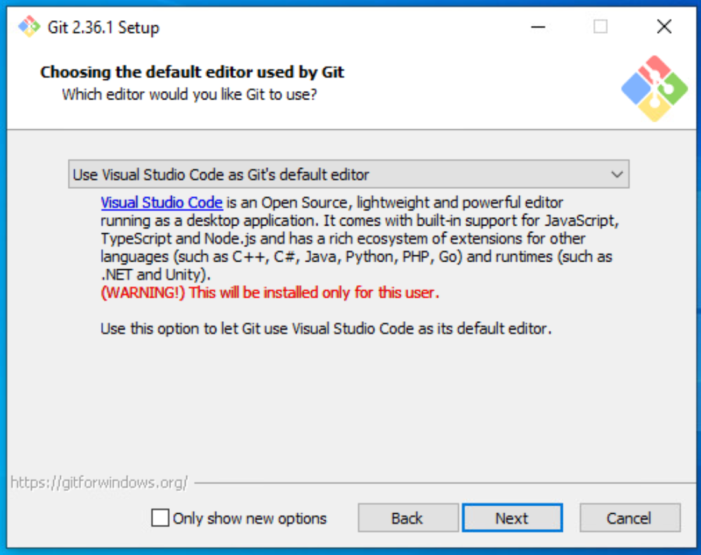
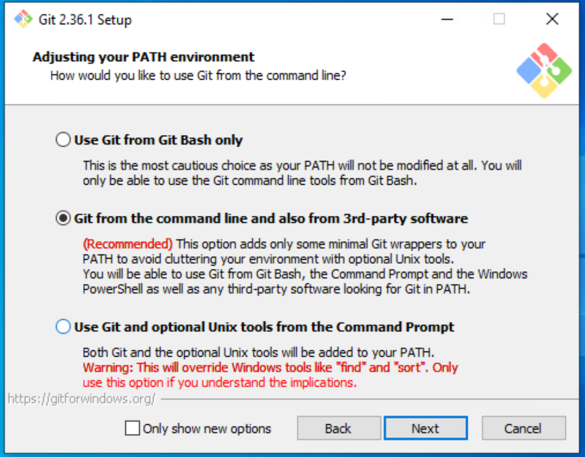
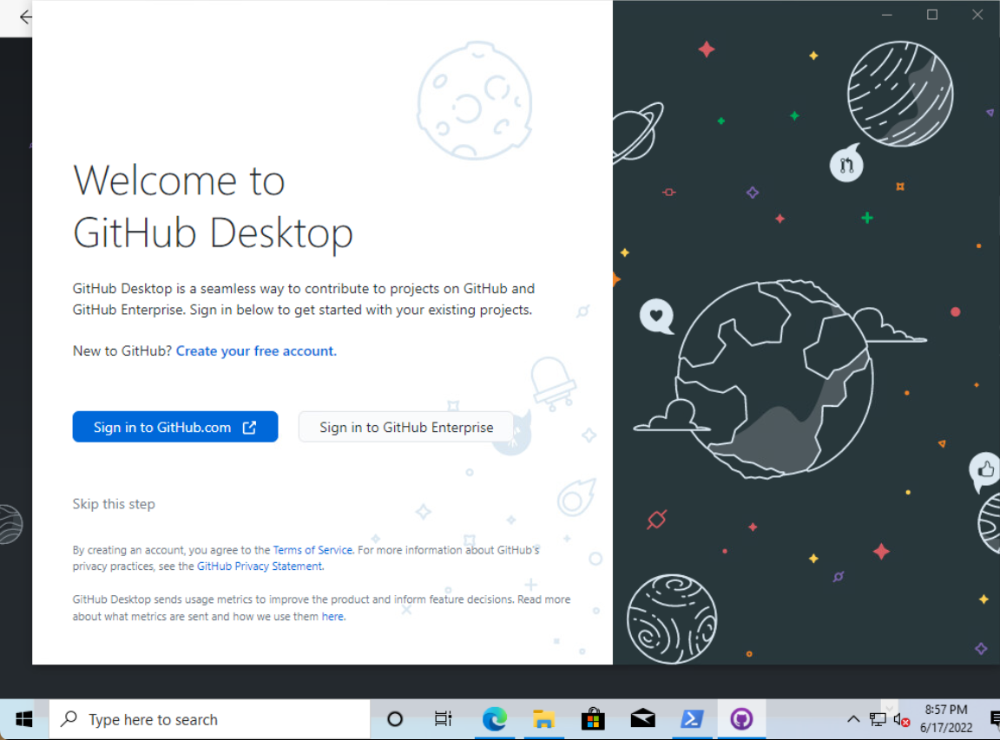
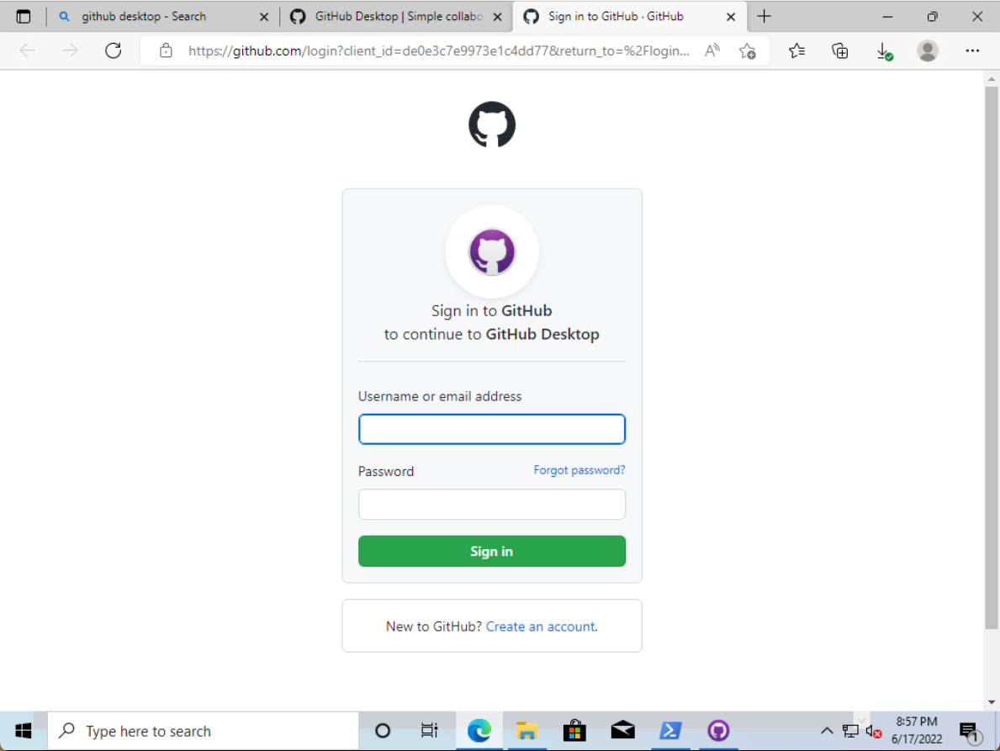

# What is Git & GitHub? -- Prep Guide
<!-- markdownlint-disable MD026 -->

_🇯🇵 日本語版: [00_Prep.md](00_Prep.md)_

This is a guide to get you ready for the `Intro to Git & GitHub` lecture.

Here are the steps to do in preparation for the lecture (in order):
  1. [GitHub.com Account](#githubcom-account)
  1. [Visual Studio Code (VS Code) + Command Line](#visual-studio-code-vs-code--command-line)
  1. [Install Git](#install-git)
  1. [GitHub Desktop App](#github-desktop-app)
  1. [GitHub Command Line (GitHub CLI)](#github-command-line-github-cli)
  1. [Configure Git](#configure-git)

## Outline <!-- omit in toc -->
* [GitHub.com Account](#githubcom-account)
  * [Step 1 - Create a GitHub.com Account](#step-1---create-a-githubcom-account)
  * [Step 2 - Set up Two-Factor Authentication](#step-2---set-up-two-factor-authentication)
* [Visual Studio Code (VS Code) + Command Line](#visual-studio-code-vs-code--command-line)
* [Install Git](#install-git)
  * [Install Git for MacOS](#install-git-for-macos)
  * [Install Git for Windows 10](#install-git-for-windows-10)
* [GitHub Desktop App](#github-desktop-app)
* [GitHub Command Line (GitHub CLI)](#github-command-line-github-cli)
  * [GitHub CLI for MacOS](#github-cli-for-macos)
  * [GitHub CLI for Windows](#github-cli-for-windows)
* [Configure Git](#configure-git)
  * [Add GitHub.com Login](#add-githubcom-login)
  * [Add GitHub Enterprise Login](#add-github-enterprise-login)
  * [Confirm GitHub Authentications were Successful](#confirm-github-authentications-were-successful)
  * [Default Branch - main](#default-branch---main)
* [Next section - Basics and Settings](#next-section---basics-and-settings)

---

## GitHub.com Account

### Step 1 - Create a GitHub.com Account
Create a GitHub.com account by signing up here:
* [github.com/join](https://github.com/join)  

Check out unsplash.com for free images to use for your profile pic:
* [unsplash.com/s/photos/cute](https://unsplash.com/s/photos/cute)
* [unsplash.com/s/photos/profile-dog](https://unsplash.com/s/photos/profile-dog)
* [unsplash.com/collections/410090/animals](https://unsplash.com/collections/410090/animals)

### Step 2 - Set up Two-Factor Authentication
1. Open GitHub.com's `Two-factor authentication` settings: [github.com/settings/security](https://github.com/settings/security)
    * Click on the `Enable two-factor authentication` button
    * Select `Set up using an app` option and click the `Continue` button
2. Scan the QR Code with a two-factor authentication app
    * Recommended two-factor authentication apps:
      * [1Password](https://1password.com/)
      * [Microsoft](https://www.microsoft.com/en-us/account/authenticator)
      * [Authy](https://authy.com/guides/github/)
      * [Enpass](https://www.enpass.io/)
3. Enter the 6-digit code from the two-factor authentication app
4. Download the recovery codes and click the `I have saved my recovery codes` button
5. Finally, click the `Done` button

Here is a gif that goes over Step 2:  
* 

### Resources <!-- omit in toc -->
* GitHub Help Doc: [Configuring two-factor authentication - GitHub Docs](https://docs.github.com/en/authentication/securing-your-account-with-two-factor-authentication-2fa/configuring-two-factor-authentication)
* YouTube: [How to setup 2FA with GitHub](https://youtu.be/5DKqXeorDHY)

---

## Visual Studio Code (VS Code) + Command Line
Install VS Code from here:
* [code.visualstudio.com](https://code.visualstudio.com/)

Setup the ability to open VS Code from the command line:
1. Launch VS Code App
1. Open the `Command Palette` with the following shortcut:
    * Mac: `Command` + `Shift` + `P`
    * Windows: `Ctrl` + `Shift` + `P`
1. Type `shell` and select the `Shell Command: Install 'code' command in PATH` option
    * 
1. Restart the Terminal
1. In the Terminal, type `code .` to open the current folder in VS Code

---

## Install Git
* [Install Git for MacOS](#install-git-for-macos)
* [Install Git for Windows 10](#install-git-for-windows-10)

### Install Git for MacOS

1. Install [Homebrew (brew.sh)](https://brew.sh/) with the following command:

    ```shell
    /bin/bash -c "$(curl -fsSL https://raw.githubusercontent.com/Homebrew/install/HEAD/install.sh)"
    ```

1. Update and upgrade `brew` before installing new packages

    ```shell
    brew update && brew upgrade
    ```

1. Install git with Homebrew

    ```shell
    brew install git
    ```

1. Confirm the install by checking the git version

    ```shell
    git --version

    # If you see this, you are all set!
    git version 2.36.1
    ```

#### Debugging <!-- omit in toc -->

|                                     |                                       |
| ----------------------------------- | ------------------------------------- |
| If the following result is returned | `git version 1.7.10.2 (Apple Git-33)` |
| Run this command!                   | `brew link --force git`               |
| Or do this!                         | `export PATH=/usr/local/bin:$PATH`    |

#### Now you are ready! <!-- omit in toc -->
Next section is [GitHub Desktop App](#github-desktop-app)!

---

### Install Git for Windows 10

1. Install git for windows from [gitforwindows.org](https://gitforwindows.org/)
1. Accept the Installation Wizard's default setting EXCEPT for the following settings:
    1. For `Choosing the default editor used by Git` setting, select the `Use Visual Studio Code as Git's default editor` option
    1. For `Adjusting the name of the initial branch in new repositories` setting, select the `Override the default branch name for new repositories` option
    1. For `Configuring the line ending conversions` setting, select the `Checkout as is, commit as is` option
    1. For `Configuring the terminal emulator to use with Git Bash` setting, select the `Use Windows's default console window` option
    1. For the last settings page, select the `Launch Git Bash` option and deselect the `View Release Notes` option

#### Screenshots of the Installation Wizard settings <!-- omit in toc -->
The non-default settings are highlighted.

  |                                                         |                                                         |
  | ------------------------------------------------------- | ------------------------------------------------------- |
  |    |    |
  |    |    |
  |    |    |
  |    |    |
  |    |  |
  |  |  |
  |  |  |

#### Now you are ready! <!-- omit in toc -->
Next section is [GitHub Desktop App](#github-desktop-app)!

---

## GitHub Desktop App

1. Download the GitHub Desktop App from here: [desktop.github.com](https://desktop.github.com/)
1. Then click the `Sign in to GitHub.com` button
1. A browser window will launch
1. Log into your GitHub.com account by following the screenshots below:

  |        |                                                   |        |                                                   |
  | ------ | ------------------------------------------------- | ------ | ------------------------------------------------- |
  | Step 1 |  | Step 2 |  |
  | Step 3 |  | Step 4 |  |
  | Step 5 |  | Step 6 |  |

GitHub Desktop App's documentation:
* English: [GitHub Desktop - GitHub Docs](https://docs.github.com/en/desktop)
* Japanese: [GitHub Desktopのドキュメント](https://docs.github.com/ja/desktop)

---

## GitHub Command Line (GitHub CLI)
* [GitHub CLI for MacOS](#github-cli-for-macos)
* [GitHub CLI for Windows](#github-cli-for-windows)

### GitHub CLI for MacOS

1. Update and upgrade brew before installing new packages

    ```shell
    brew update && brew upgrade
    ```

1. Install [GitHub CLI](https://cli.github.com/) with the following command:

    ```shell
    brew install gh
    ```

1. Restart the computer before using GitHub CLI

#### Now you are ready! <!-- omit in toc -->
Next section is [Configure Git](#configure-git)!

### GitHub CLI for Windows

1. Install [GitHub CLI](https://cli.github.com/) by going to [cli.github.com](https://cli.github.com) and clicking on the `Download for Windows` button
1. Accept the Installation Wizard's default setting
1. Restart the computer before using GitHub CLI

#### Now you are ready! <!-- omit in toc -->
Next section is [Configure Git](#configure-git)!

---

## Configure Git

### Add GitHub.com Login
We will use GitHub CLI's `gh auth login` command to configure the GitHub login

Where to run the commands?
* For Mac users: Use the [Terminal](https://support.apple.com/guide/terminal/welcome/mac) for both git commands (`git`) and GitHub CLI commands (`gh`)
* For Windows users: Use the [Command Prompt](https://en.wikipedia.org/wiki/Cmd.exe) for both git commands (`git`) and GitHub CLI commands (`gh`)

Add GitHub.com login to your computer by going through the following steps:
1. Run `gh auth login` command
1. For `What account do you want to log into?` prompt, select `GitHub.com` option
1. For `What is your preferred protocol for Git operations?` prompt, select `HTTPS` option
1. For `Authenticate Git with your GitHub credentials? (Y/n)` prompt, type `y`
1. Copy the 9-character code and hit `enter`
1. A browser window will launch
1. Enter the 9-character code to the GitHub website
1. Click the `Authorize` button

### Add GitHub Enterprise Login
1. Run `gh auth login --hostname <hostname>` command
    * Example hostname: `github.dev.ahandsel.co.jp`
1. For `What is your preferred protocol for Git operations?` prompt, select `HTTPS` option
1. For `Authenticate Git with your GitHub credentials? (Y/n)` prompt, type `y`
1. Copy the 9-character code and hit `enter`
1. A browser window will launch
1. Enter the 9-character code to the GitHub website
1. Click the `Authorize` button

### Confirm GitHub Authentications were Successful
Confirm settings with the following command: `gh auth status`

This is what you want to see:

  ```shell
  ❯ gh auth status
  github.com
    ✓ Logged in to github.com as ahandsel (/Users/***/.config/gh/hosts.yml)
    ✓ Git operations for github.com configured to use https protocol.
    ✓ Token: *******************

  github.dev.ahandsel.co.jp
    ✓ Logged in to github.dev.ahandsel.co.jp as ahandsel (/Users/***/.config/gh/hosts.yml)
    ✓ Git operations for github.dev.ahandsel.co.jp configured to use https protocol.
    ✓ Token: *******************
  ```

### Default Branch - main
* `main` or `master` is set as the default branch name by git.
* The past default is `master` but now it is best-practice to use `main` (given the meaning of the world _master_ 😅)

Use the following command to set the default branch name to `main` for your computer.

```shell
git config --global init.defaultBranch main
```

---

## Next section - Basics and Settings
Go to the [Basics & First Repo - 01_Start_EN.md](01_Start_EN.md) section 💪

## List of Lecture Guides <!-- omit in toc -->
[README_EN.md](README_EN.md) ⚙️
