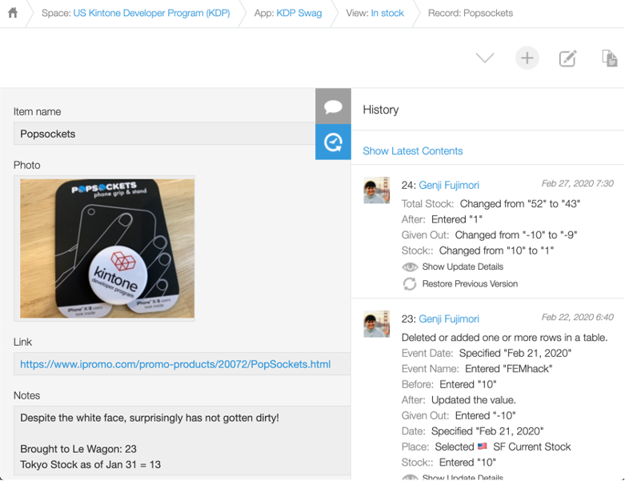
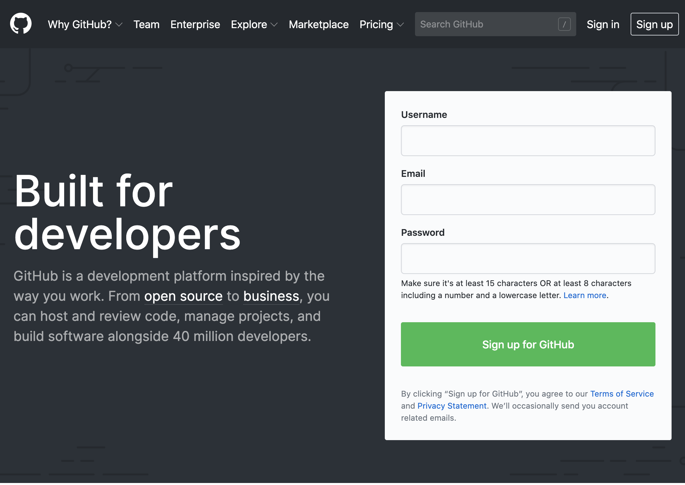
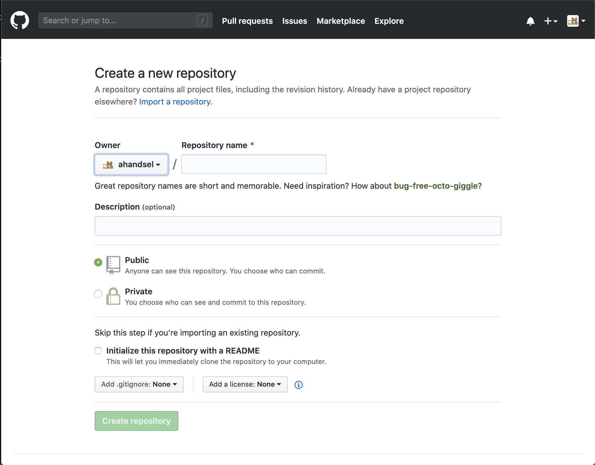

# Git, GitHubとは？ - 基本と最初のレポ

_🇺🇸 English version: [01_Start_EN.md](01_Start_EN.md)_

このセクションでは, Git と GitHub を紹介し, 最初のリポジトリの設定について説明します

## 概要
* Git の基本
* GitHub の基本
* リポジトリを作成する ハンズオン
* 一般的な Git コマンドの概要

## 目次 <!-- omit in toc -->
* [概要](#概要)
* [Git とは…](#git-とは)
  * [バージ?](#バージ)
  * [バージョン管理の例](#バージョン管理の例)
* [GitHub とは…](#github-とは)
  * [GitHub 例 - Apple](#github-例---apple)
* [リポジトリの設定 - ハンズオン](#リポジトリの設定---ハンズオン)
  * [ローカルGitリポジトリを作成する](#ローカルgitリポジトリを作成する)
  * [README.md ファイルの追加](#readmemd-ファイルの追加)
  * [Git のステータスを確認する](#git-のステータスを確認する)
  * [ステージングエリアにファイルを追加](#ステージングエリアにファイルを追加)
  * [Gitリポジトリにファイルを追加](#gitリポジトリにファイルを追加)
  * [GitHub リポジトリを作成する](#github-リポジトリを作成する)
  * [Local Git --> GitHub](#local-git----github)
    * [デバッグ](#デバッグ)
  * [Hands-on A が完了しました](#hands-on-a-が完了しました)
* [Git の基本的なコマンドの概要](#git-の基本的なコマンドの概要)
  * [Git での変更の保存方法](#git-での変更の保存方法)
    * [待って, ステージングエリア? 🤔](#待って-ステージングエリア-)
    * [Git フォルダーの中身は何ですか? 🤔](#git-フォルダーの中身は何ですか-)
  * [リモートリポジトリの操作](#リモートリポジトリの操作)
  * [git push?](#git-push)
    * [ゲームの例-どうぶつの森](#ゲームの例-どうぶつの森)
* [ハンズオン A レビュー](#ハンズオン-a-レビュー)
* [クイズの時間](#クイズの時間)
* [次のセクション](#次のセクション)

---

## Git とは…
* [Git](https://git-scm.com/) とは, ソフトウェア開発のための __バージョン管理__ を提供するソフトウェアです.
* Linux カーネル開発を管理するツールとして2005年に開始.
* 無料で使えるオープンソースの分散バージョン管理システム.

### バージ?
履歴 ⌛
* 時間とともに加えられていく変更を記録することができます.

チームワーク 💪
* 他のシステムを使う開発者と共同作業をすることができます.

バックアップ 💾
* 後で特定バージョンを呼び出すことができるようになります.

ゲームのセーブポイント 📌
* "バージョン管理" は, ゲームのチェックポイント システムに似ています.
* レベルをクリアすれば, ゲームの現在のレベルを保存します.
* その後, 次のレベルで間違えてもゲームをリスタートしません.

### バージョン管理の例

| Google Docs                                                  | Kintone                                                |
| ------------------------------------------------------------ | ------------------------------------------------------ |
|  |  |

## GitHub とは…

* [GitHub](https://github.com/) とは共同開発プラットフォームです
* コードを見たり見せたりできる場所です.
  * Google Docs とちょっと似ていて, いろんな人たちがコードを同時に見たり編集できます.
  * `Remote repositories` (リモートリポジトリ) と聞いたら, GitHub だなっと考えてください.
* 2008年に設立され, 現在はマイクロソフトの子会社です.

|                                                       |                                                  |
| ----------------------------------------------------- | ------------------------------------------------ |
|  |  |

### GitHub 例 - Apple
Appleが, パスワードマネージャーなどのアプリの開発者向けに, 強力なパスワードを生成できるよう支援するための一連のツールとリソースを無償公開している.

[github.com/apple/password-manager-resources](https://github.com/apple/password-manager-resources)

[アップル, 「Password Manager Resources」をオープンソースで公開 - ZDNet Japan](https://japan.zdnet.com/article/35154931/)

---

## リポジトリの設定 - ハンズオン
ローカルでの設定
* フォルダを作成する.
* フォルダを Git で管理するように構成する.

GitHub の設定
* GitHub で "フォルダ" のようなものを作成する.
* `Repository` (リポジトリ) と呼ばれています.

ローカルと GitHub を接続する
* 接続するように2つを構成する.
* ローカル側でファイルを作成して Git コマンドを実行すると, ファイルは GitHub に表示されます.

---

### ローカルGitリポジトリを作成する

⚠️ 準備ガイド, [準備内容 - 00_Prep.md](00_Prep.md), に記載されている手順をすでに完了していることを確認してください。

⚡ コマンドはどこで実行しますか?
* Mac: [ターミナル](https://support.apple.com/ja-jp/guide/terminal/welcome/mac) を使う
* Windows: [Command Prompt](https://en.wikipedia.org/wiki/Cmd.exe) を使う

1. アクセスしやすいフォルダーに移動し, `learning_git` という名前のディレクトリを作成します.  

    ```sh
    cd Documents
    mkdir learning_git
    cd learning_git
    ```

1. `pwd` コマンドを使用して, 正しい場所にいることを確認します

    ```sh
    pwd

    /Users/YourUserName/Documents/learning_git
    ```

1. `git init` コマンドで git リポジトリを初期化します.

    ```sh
    git init

    Initialized empty Git repository in /Users/YourUserName/Documents/learning_git/.git/
    ```

⚡ Repository (リポジトリ) は, Repo と短縮されて呼ばれることもあります.

---

### README.md ファイルの追加

1. README.md ファイルを作成します.

    ```sh
    touch README.md
    ```

1. README.md ファイルにリポジトリの説明を追加します.

    ```sh
    vi README.md

    # また

    code README.md
    ```

    ```markdown
    # Learning JS Repo
    JavaScript 講義と課題のリポジトリです.
    ```

⚡ README.md ファイルは, ソフトウェアや git リポジトリの目的や使用方法を説明するために使用されます.

---

### Git のステータスを確認する

`git status` コマンド
* 作業ディレクトリとステージングエリアを表示します
* `Changes to be committed`: どのファイルに変更が加えられているのか確認できます
* `Untracked files`: どのファイルは Git で追跡していないのかを確認できます

画像を確認すると, README.md を追跡する必要があることがわかります

```sh
git status
```

```sh
On branch main
No commits yet
Untracked files:
  (use "git add <file>..." to include in what will be committed)
 README.md
nothing added to commit but untracked files present (use "git add" to track)
```

### ステージングエリアにファイルを追加

`git add <file/folder>`
* ファイル/フォルダーをステージングエリアに追加するコマンド

```sh
git add README.md
```

現在README.mdはステージングエリアに存在します

```sh
git status
```

```sh
On branch main
No commits yet
Changes to be committed:
  (use "git rm --cached <file>..." to unstage)
 new file:   README.md
```

### Gitリポジトリにファイルを追加

`git commit -m "message"`
* ファイル/フォルダをリポジトリに追加するコマンド
* [Git - git-commit Documentation](https://git-scm.com/docs/git-commit)

README.mdがリポジトリに追加されました!!
* `README.md` が `main` ブランチに追加されたことが分かります

```sh
git commit -m "README file created"

git status
```

```sh
$ git commit -m "README file created"
[main (root-commit) 03098e7] README file created
 1 file changed, 3 insertions(+)
 create mode 100644 README.md

$ git status
On branch main
nothing to commit, working tree clean
```

### GitHub リポジトリを作成する

リポジトリを作成する
* [github.com/new](https://github.com/new)

`learning_git` という名前のリポジトリを作成します

READMEでリポジトリを初期化しないでください


### Local Git --> GitHub

repository を `push` しましょう！
GitHub の `Clone or download` ボタンをクリックし, HTTPS リンクをコピーして URL を取得します

`git remote add origin <link>`
* ローカルリポジトリを GitHub のリモートリポジトリに接続します
* `git remote` はリモートリポジトリを管理するコマンドです
* [Git - git-remote Documentation](https://git-scm.com/docs/git-remote#_name)

```sh
git remote add origin https://github.com/Your_GitHub_UserName/learning_git.git
git push -u origin main
```

端末からの結果

```terminal
Enumerating objects: 3, done.
Counting objects: 100% (3/3), done.
Delta compression using up to 4 threads
Compressing objects: 100% (2/2), done.
Writing objects: 100% (3/3), 298 bytes | 298.00 KiB/s, done.
Total 3 (delta 0), reused 0 (delta 0), pack-reused 0
remote: This repository moved. Please use the new location:
remote:   https://github.com/ahandsel/learning_git.git
To https://github.com/ahandsel/learning_git.git
 * [new branch]      main -> main
Branch 'main' set up to track remote branch 'main' from 'origin'.
```

#### デバッグ
ローカルと GitHub の間で同期する最初のリポジトリを設定するときに, ログイン問題が発生する可能性があります。

1. リモートリポジトリ設定を削除

    ```sh
    git remote remove origin
    ```

2. 新しいパーソナルアクセストークンを作成する  
    * [github.com/settings/tokens/new](https://github.com/settings/tokens/new)
    * 端末から GitHub アカウントにログインするときに, Github パスワードの代わりにトークンを使用します

3. もう一度試してみましょう

    ```sh
    git remote add origin https://github.com/Your_GitHub_UserName/learning_git.git
    git push -u origin main
    ```

4. Github.com のリポジトリをチェックして, プッシュが機能したことを確認します。
    * `https://github.com/`Your_GitHub_UserName`/learning_git.git`


#### Documentation <!-- omit in toc -->
* [リモートリポジトリを管理する - GitHub Docs](https://docs.github.com/ja/github/getting-started-with-github/getting-started-with-git/managing-remote-repositories)
* [Git - git-remote Documentation](https://git-scm.com/docs/git-remote)
* [Git - git-push Documentation](https://git-scm.com/docs/git-push)

---

### Hands-on A が完了しました

| Git を初期化する                        | GitHub を設定する                        | ローカルリポジトリを作成してプッシュする |
| --------------------------------------- | ---------------------------------------- | ---------------------------------------- |
| `git init` <br> `git remote add origin` | [github.com/new](https://github.com/new) | `git status` <br> `git commit -m`        |

---

## Git の基本的なコマンドの概要

### Git での変更の保存方法

スペース間でアイテムを転送する2つのコマンドがあります:
* `git add` & `git commit`

ファイル, フォルダの変更が保存される3つのスペースがあります:
* `working directory` (作業ディレクトリ)
* `staging area` (ステージングステージング)
* `repository` (リポジトリ)


|       |                                  |
| :---: | :------------------------------: |
|       |     [ working directory ✍️ ]      |
|       |         ↘️  `git add` 📥 ↘️         |
|       |        [ staging area 📂 ]        |
|       |       ↘️  `git commit` 💾 ↘️        |
|       |         [ repository 🗄️ ]         |
|       |        ↘️  `git push` 🔄 ↘️         |
|       | [ remote repository (GitHub) 🌐 ] |

---

|       |                                  |
| :---: | :------------------------------: |
|   ➡️   |     [ working directory ✍️ ]      |
|   ➡️   |         ↘️  `git add` 📥 ↘️         |
|   ➡️   |        [ staging area 📂 ]        |
|       |       ↘️  `git commit` 💾 ↘️        |
|       |         [ repository 🗄️ ]         |
|       |        ↘️  `git push` 🔄 ↘️         |
|       | [ remote repository (GitHub) 🌐 ] |

`working directory` (作業ディレクトリ) ✍️
* すべての変更は最初に作業ディレクトリーで行われます

`git add` 📩
* 作業ディレクトリからステージングエリアへ追加するコマンド

`staging area` (ステージングステージング) 📂
* 作業ディレクトリとリポジトリの間のバッファ用スペース
* 以前は「インデックス」と呼ばれていました
* ある特定の変更のみを追加し, まとめてリポジトリに追加する準備を行うことができます

---

#### 待って, ステージングエリア? 🤔
* ファイルをステージングする = コミットのためのファイルを準備する

あなたが音楽を作っていると想像してください 🎶
* あなたは様々なメッセージを含められた曲を書いています
  * 怒りの歌から愛の歌まですべて
* すべての音楽をランダムにアップロ?
  * いいえ, テーマを付けたアルバムを作りますよね

ロマンチックなアルバムを作成するには 🎶
* ラブソングだけを `git add` します
* すべてのラブソングを追加するまでの間決められたラブソングは `Staging Area`で保存されています.
* アルバム内の必要なすべての曲を `Staging Area` に保存したら, コミットする時間です
* `git commit -m` する時, "Love Song" ってアルバムのタイトルをコメント追加してコミットします

---

|       |                                  |
| :---: | :------------------------------: |
|       |     [ working directory ✍️ ]      |
|       |         ↘️  `git add` 📥 ↘️         |
|       |        [ staging area 📂 ]        |
|   ➡️   |       ↘️  `git commit` 💾 ↘️        |
|   ➡️   |         [ repository 🗄️ ]         |
|       |        ↘️  `git push` 🔄 ↘️         |
|       | [ remote repository (GitHub) 🌐 ] |

`git commit` 💾
* リポジトリへ変更を記録するコマンド
* 変更を保存したいファイルがステージングエリアに配置されたら, `git commit` コマンドを使用します
* ボスを倒してゲームの進行状況を保存したいときに使用するイメージです
* コミットごとにどんな変更を記録するのかを把握するためのコメントを残します

`repository` 🗄️
* Git リポジトリは, プロジェクト内の `.git` フォルダで管理されています
* リポジトリは, プロジェクトの変更を追跡できます。

#### Git フォルダーの中身は何ですか? 🤔

⚡ Windows の場合, `ls` の代わりに `dir` コマンドを使用します

```sh
$ pwd
/Users/UserName/Documents/learning_git

$ ls -la
total 8
drwxr-xr-x   4 UserName  staff  128 Jun  9 14:54 .
drwx------@ 20 UserName  staff  640 Jun  8 16:22 ..
drwxr-xr-x  12 UserName  staff  384 Jun  9 14:56 .git
-rw-r--r--   1 UserName  staff   85 Jun  9 14:54 README.md

$ cd .git

$ ls -la
total 40
drwxr-xr-x  12 UserName  staff  384 Jun  9 14:56 .
drwxr-xr-x   4 UserName  staff  128 Jun  9 14:54 ..
-rw-r--r--   1 UserName  staff   20 Jun  9 14:54 COMMIT_EDITMSG
-rw-r--r--   1 UserName  staff   23 Jun  9 14:54 HEAD
-rw-r--r--   1 UserName  staff  316 Jun  9 14:56 config
-rw-r--r--   1 UserName  staff   73 Jun  9 14:54 description
drwxr-xr-x  14 UserName  staff  448 Jun  9 14:54 hooks
-rw-r--r--   1 UserName  staff  137 Jun  9 14:54 index
drwxr-xr-x   3 UserName  staff   96 Jun  9 14:54 info
drwxr-xr-x   4 UserName  staff  128 Jun  9 14:54 logs
drwxr-xr-x   7 UserName  staff  224 Jun  9 14:54 objects
drwxr-xr-x   5 UserName  staff  160 Jun  9 14:56 refs
```

---

|       |                                  |
| :---: | :------------------------------: |
|       |     [ working directory ✍️ ]      |
|       |         ↘️  `git add` 📥 ↘️         |
|       |        [ staging area 📂 ]        |
|       |       ↘️  `git commit` 💾 ↘️        |
|       |         [ repository 🗄️ ]         |
|   ➡️   |        ↘️  `git push` 🔄 ↘️         |
|   ➡️   | [ remote repository (GitHub) 🌐 ] |

`git push <remote> <branch>` 🔄
* Local Repo --> Remote Repo
* ローカルリポジトリをリモートリポジトリにアップロードするコマンドです
* コミットをエクスポートします

`remote repository` (GitHub) 🌐
* GitHub のサーバー上のリポジトリであり, コードを他のユーザーが確認できるようにします

---

### リモートリポジトリの操作

`git remote add origin <link>`
* ローカルマシンにリモートリポジトリのクローンを作成すると, Git によって `alias` が作成されます。
* `origin` はリモートリポジトリのURLのニックネームのようなものです
* 最も一般的な `alias` は 「 `origin` 」 と呼ばれます。
* 次のコマンドはどちらも同じ内容を実行します

   ```sh
   $ git push -u https://github.com/ahandsel/demo.git main
   ```

   ```sh
   $ git remote add ALIAS https://github.com/ahandsel/demo.git 
   $ git push -u ALIAS main
   ```

`git remote`
* ローカルとリモートのリポジトリ間の接続を管理します

`git remote --verbose`
* Gitが保存しているURLと, そのリモートリポジトリへの読み書き時に使用できるエイリアス (ニックネーム)を一覧表示します。

    ```sh
    git remote --verbose
    ```

    ```sh
    origin https://github.com/ahandsel/learning_git.git (fetch)
    origin https://github.com/ahandsel/learning_git.git (push)
    ```

#### Documentation <!-- omit in toc -->
* [Git - リモートでの作業](https://git-scm.com/book/ja/v2/Git-%E3%81%AE%E5%9F%BA%E6%9C%AC-%E3%83%AA%E3%83%A2%E3%83%BC%E3%83%88%E3%81%A7%E3%81%AE%E4%BD%9C%E6%A5%AD)
* [Git - Working with Remotes](https://git-scm.com/book/en/v2/Git-Basics-Working-with-Remotes)
* [Git - git-remote Documentation](https://git-scm.com/docs/git-remote)

---

### git push?
`git push <remote> <branch>` 🔄
* Local Repo --> Remote Repo | コミットをエクスポートします
* `git fetch` の対応
  * ローカルリポジトリへのインポートコミット
* ⚠️ 注: プッシュすると, 変更が上書きされる可能性があります。

`git push` コマンドは, 最後のプッシュまたはクローン以降に変更されていないリモートリポジトリに対してのみ機能します
* つまり, リモートリポジトリを変更した人は他にいません
* あなたと別のクローンが同時にあなたの前に上流にプッシュした場合, そのプッシュは正しく拒否されます。
* 最初に彼らの仕事をフェッチしてプッシュに含める必要があります

#### ゲームの例-どうぶつの森
* Genji は島にテントを追加しました。
* Genji がゲームステータスを GitHub にアップロードしました。
* Piyoも島に家を追加しました。
* しかし, GitHub にアップロードする前に...
  * GitHub から最新のゲームステータスを取得する必要があります
  * ( Genji がテントを追加したため)

#### Documentation <!-- omit in toc -->
* [Git - git-push Documentation](https://git-scm.com/docs/git-push)

## ハンズオン A レビュー

Git での保存

|                                  |    音楽 🎶    |
| :------------------------------: | :----------: |
|     [ working directory ✍️ ]      |   個別の曲   |
|         ↘️  `git add` 📥 ↘️         |              |
|        [ staging area 📂 ]        |   アルバム   |
|       ↘️  `git commit` 💾 ↘️        |              |
|         [ repository 🗄️ ]         | プレイリスト |
|        ↘️  `git push` 🔄 ↘️         |              |
| [ remote repository (GitHub) 🌐 ] |   Spotify    |

`git remote`  
ローカルとリモートのリポジトリ間の接続を管理するコマンド

`git push`  
ローカルリポジトリをリモートリポジトリにアップロードするコマンド

## クイズの時間

1. Git と GitHub はどのように関係?  
   * ヒント: `hub` とは, 活動またはネットワークの中心点です。
2. `git add` と `git commit` のどちらを初め?
   * ヒント: `commit` とは, 特定の行動 (結婚など) を約束することです。
3. `git push` コマンドは?
   * ヒント: `git push` コマンドは `git fetch` コマンドの逆の行動を行います。

<details>
  <summary>回答</summary>

1. Git と GitHub はどのように関係?  
    * GitHub は, みんなの Git を集めた __hub__ / コレクション の中心です．
    * GitHub は人気のある __remote repo__ オプションです
1. `git add` と `git commit` のどちらを初め?
    * まず, `git add` を使用して, 個々の変更を集めます
    * そして, `git commit` を使用して, 変更を包みます
1. `git push` コマンドは?
    * __commit__ をリモートリポジトリにアップロードするねは, `git push` を使用します
    * リポジトリの最新バージョンを取得するねは, `git fetch` を使用します
</details>

---

## 次のセクション
[ブランチの作成とマージ - 02_Branches.md](02_Branches.md) へ 💪

## 講義ガイド一覧 <!-- omit in toc -->
[README.md](README.md) ⚙️
